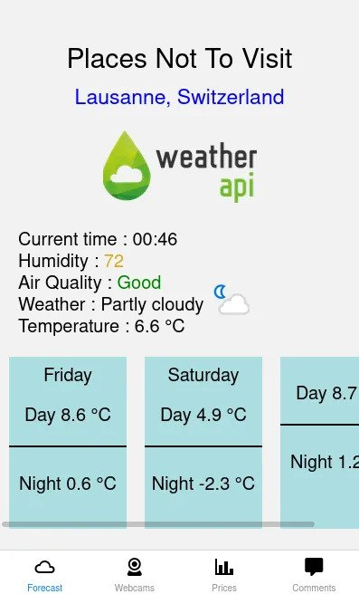
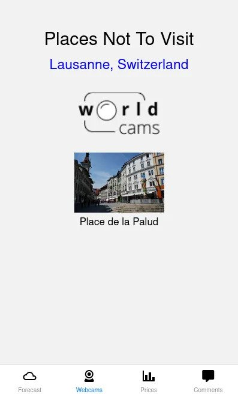
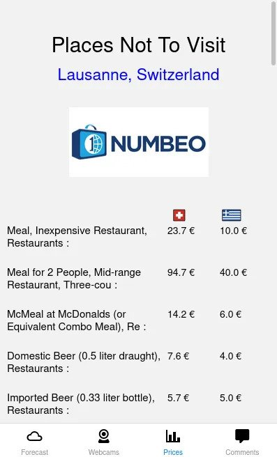

# Places-not-to-visit

A travel guide application you might use before traveling.

## Features

- 3-day forecast. (data being fetched from [weatherapi](https://www.weatherapi.com/))
- Live footage from cameras in the cities. (only a few cities are included. Such as Lausanne,Switzerland Venice,Rome)
- Price comparison between Thessaloniki,Greece and the other city. (data drawn from [numbeo](https://www.numbeo.com/cost-of-living/))
- Sentiment analysis on user reviews from most rated stores of a selected place.

