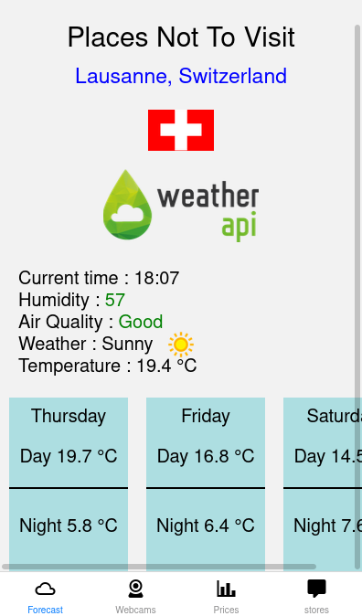
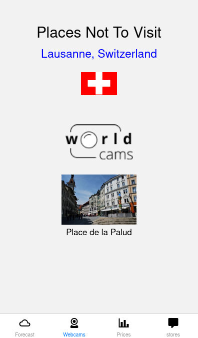
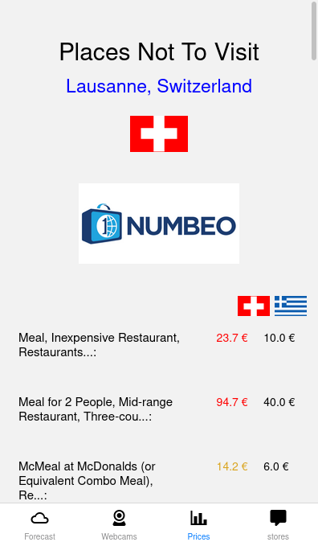
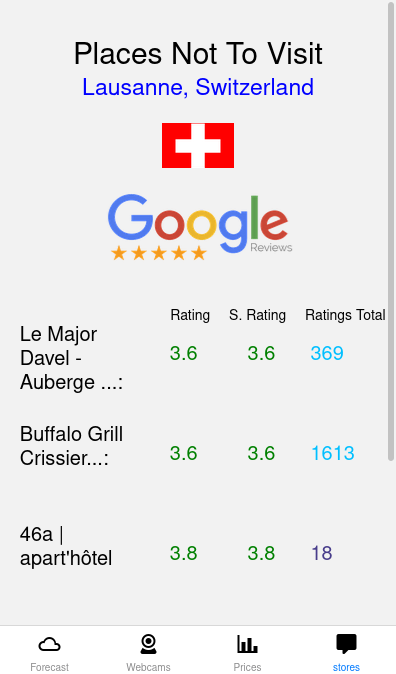
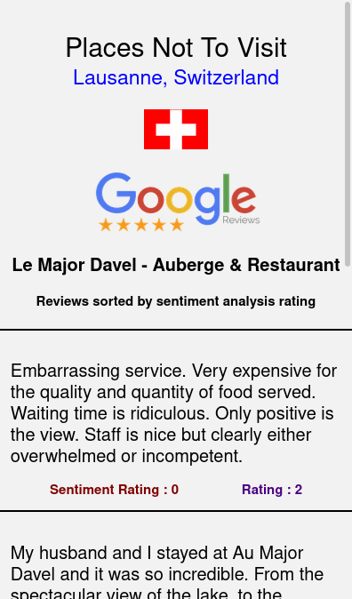

# Places-not-to-visit

<h2>A travel guide application you might use before traveling. It shows various information to help you decide, which place is not visitable. In contrast with other types of travel guide applications the app is focused to find the poorest store quality, but also giving an objective view about the place, such us weather, prices and live footage from cameras. </h2>

    
    
    
    
    

## Features

- 3-day forecast along with Current time, Humidity, Air Quality, Weather and Temperature. (data => [weatherapi](https://www.weatherapi.com/))
- Live footage from cameras in the cities. (only a few cities are included. Such as Lausanne,Switzerland, Venice, Rome etc.) [worldcams](https://worldcams.tv/))
- Price comparison between Thessaloniki,Greece and the requested city. (data => [numbeo](https://www.numbeo.com/cost-of-living/))
- City Stores in 30km proximity from its center, it shows the first 5 stores sorted in ascending order by the worst rated to best. It additionally shows the sentiment analysis average rating and the total number of ratings. (data => [googlePlacesApi](https://developers.google.com/maps/documentation/places/web-service/overview))
  - After clicking each store the user can see specifically each review alongside with its rating and sentiment analysis rating 

## Using the application

- There aren't any api keys given so each user has to hardcode the api keys in the application.

